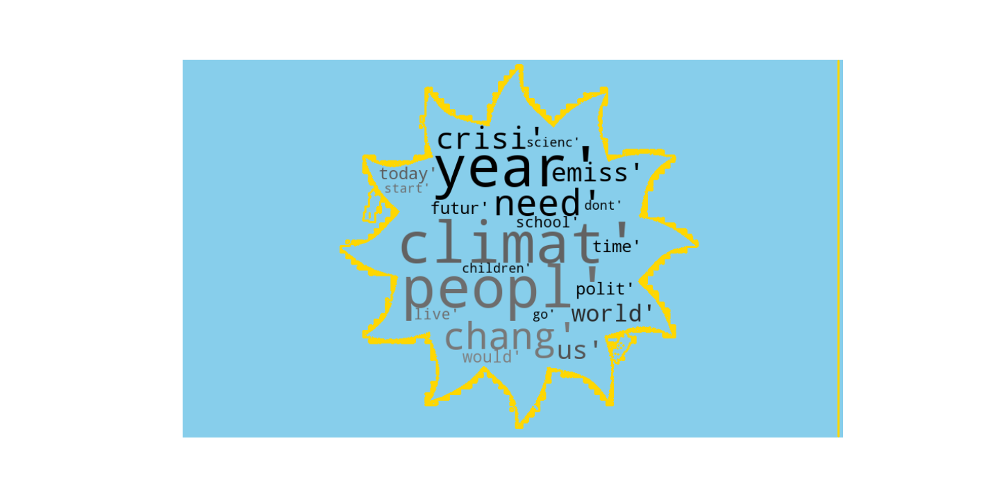
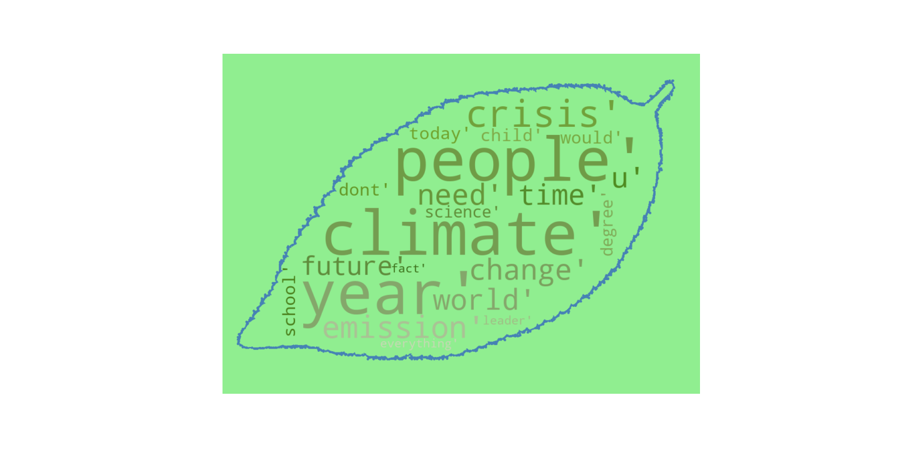

Table of Content
================
* [Climate_Speeches](#Climate_Speeches)
  * [Description](#description)
  * [Datasets](#datasets)
  * [Results](#results)
  * [Installation Requirements](#installation-requirements)
  * [Licensing](#licensing)
  * [Author](#Authors)

# Climate Speeches


## Description
This is a project developed at the CRI Université de Paris in the second semester of the Master of Digital Science, within the Challenge Hub program. the project is the sentiment analysis of 16 speeches delivered by the famous activist greta thunberg, who has given speeches in different places, with different audiences.
In addition, the analysis of each of the speeches will be made to see if they are positives or negatives and all those are based on opinions or facts. the speeches were realized in 2018, 2019 and 2020.
It is clarified that they are not all the speeches made by the activist in those years.

## Datasets
The dataset is developed by me, I base myself on the book "No one is too small to make a difference" and the article "[Greta Thunberg – the future speaks](https://www.environmentshow.com/greta-thunberg-speeches/)" to do so the data was taken and for the part of the transcriptions it was done three different ways: first the articles where the transcripts of the speeches, second for those who do not have a transcription in an article, the transcription option of the page [youtube](https://www.youtube.com/)  was used and if this was in the book it was compared with the text of the book, for which it was not verified that the transcription is as accurate as the speech itself.

* Speeches.csv

Columns in the datasets:

- `Title`: Title of the speech.
- `Event`: identifies the event of the speech.
- `Location`: the city on the Earth's surface.
- `Date`: the date of each speech.
- `Link Video`: identifies the link video of the speech on the platform  [youtube](https://www.youtube.com/) 
- `Trascript from`: it is the link to the webside of the trascription of each speech. 
- `Script`: it is the trascription of each speech. 
- 
## Results
The presented graphs were divided into groups to be able to compare the performance of the vaccination campaign, the first group has the four types of vaccines, the second the comparison between the first and second doses, the third is the comparison between the male and female genders in the total doses applied by each supplier.







## Installation Requirements
- Download Zip
```
Code - Download ZIP
```

- Clone this repository with this command
```
git clone https://github.com/Eli-2020/climate_speeches.git
```
- Install the project dependencies run pip install -r requirements.txt
```
pip install -r requirements.txt
```
- Requirements includes:
```
pandas == 1.2.4
streamlit==0.82.0
plotly==4.14.3
```
To run the streamlit code
```
streamlit run app.py
```
## Licensing
[](https://opensource.org/licenses/MIT)


## Author:

* **Eliseo Baquero** [@Eli-2020](https://github.com/Eli-2020)
